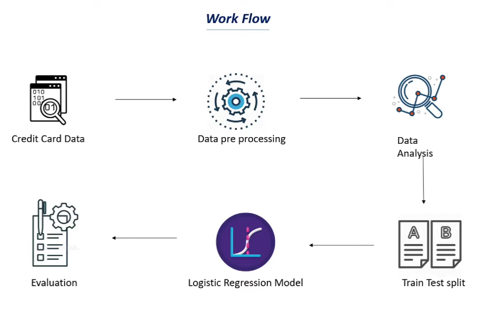

# Credit Card Fraud Detection_System_using_Machine_Learning

## Overview

Here we will create a system in python where a user can detact the crdit card that can Detect suspicious users without asking for IDs. SEON gathers invisible digital footprint data from a device, IP, email address, or phone number and Block bad signups with our background check before triggering expensive KYC checks. Meet simplified due diligence requirements and Verify signups from any country with real-time lookups. Digital footprints are reliable even if the bureau data is stale or non-existent and Leverage an invisible data screening process that doesn't interfere with your existing KYC process. Maintain a frictionless user experience and Avoid KYC and AML fines by showing that you screen every user and transaction. You can even use the same data to trigger exceptions for 3DS checks and Approve or decline transactions manually with tailorable risk scores and rules. Aided by our whitebox Machine Learning system, decrease time spent on manual investigations by 90%.

### and this is how is the data by this steps workd flow 

We use Google Collab to write the code here is the link :

## We use Google Collab to write the code here is the link :

https://colab.research.google.com/drive/1TtT8Hm3gqr5nMystDxC3pMACajfvEnIC?usp=sharing

## We use  kaggle to download the Data CSV files for Data types:

https://www.kaggle.com/datasets/mlg-ulb/creditcardfraud 

## Summary
In this project, we create a Credit Card Fraud Detection for a user that can be detect the cridt card to define the credit card by using the data of the banks account or to know how is credit card.